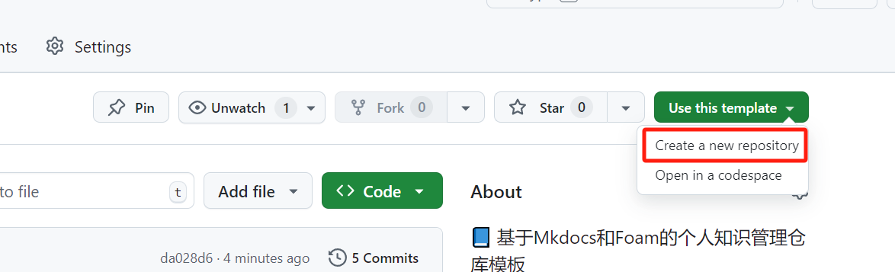

# MkDocs Foam Template


一款自动管理并部署个人知识库的模板仓库。基于[Foam](https://github.com/foambubble/foam)管理个人笔记，通过[MkDocs](https://www.mkdocs.org/getting-started/)部署至云端。

[在线预览](https://orionxer.github.io/mkdocs_foam_template)

知识图谱预览


- [ ] 压缩图片体积，加快访问README的速度

## 快速开始
> [!IMPORTANT]  
> 使用该仓库默认你已经熟悉`VSCode`并了解`Git`的相关知识以及操作。

### 安装VSCode插件
- Foam
- Markdown All in One
- Markdown Footnotes
- Markdown Preview Enhanced
- Markdown Preview Github Styling
- Prettier - Code formatter
- Flutter Color

### 下载仓库
```sh
git clone https://github.com/Orionxer/mkdocs_foam_template
```
也可以选择`Fork`或者使用模板创建自己的仓库，再下载到本地

<details>
<summary>点击查看图片</summary> 


</details>

### 环境依赖
进入项目
```sh
cd mkdocs_foam_template
```
安装依赖
```sh
pip install -U -r requirements.txt
```

### Foam知识图谱
通过`VSCode`打开该项目，`Ctrl + Shift + P`调出命令控制器，输入`Show graph`，选择`Foam: Show graph`查看知识图谱。同时打开Markdown预览，点击图谱中的**节点**或者笔记中的**双向链接**，就可以跳转到对应的笔记。


### MkDocs本地部署

> [!TIP]  
> 默认使用[Material for MkDocs](https://squidfunk.github.io/mkdocs-material/)主题，如果需要更换主题则需要修改`requirements.txt`和`mkdocs.yml`以及`.github/workflows/ci.yml`对应的内容

部署命令
```sh
mkdocs serve
```
成功部署后，控制台会输出`http://127.0.0.1:8000`地址，`Ctrl`+单击该地址就会在默认浏览器中打开该地址查看部署效果


## 在线部署(可选)
> [!NOTE]  
> 当Github检测到代码推送的时候，通过配置好的Github Actions和Pages就能实现自动化部署网站。[在线部署效果预览](https://orionxer.github.io/mkdocs_foam_template)

### 设置Actions权限
- 点击仓库中的`Settings`选项卡
- 展开`Actions`，选择`General`
- 找到`Workflow permissions`，选择`Read and write permissions`，并勾选`Allow GitHub Actions to create and approve pull requests`
- 点击`Save`保存
   
<details>
<summary>点击查看图片</summary>


</details>

### 推送代码
适当修改内容，尝试向Github推送一次代码。等待几分钟，确保仓库主页存在`gh-pages`分支。
> Github会根据`.github/workflows/ci.yml`配置自动执行`mkdocs gh-deploy --force`命令，也就是Github Actions会创建一个`gp-pages`分支，并将`mkdocs build`的内容上传至该分支。

### 部署分支
- 点击仓库中的`Settings`选项卡
- 点击`Pages`，在`Build and deployment`下的Branch，选择`gh-pages`, 路径选择`/root`
- 点击`Save`保存

<details>
<summary>点击查看图片</summary>


</details>

等待页面出现`Your site is live at https://xxxx`就说明部署成功了，点击`Visit site`按钮就可以访问该网站


### 自定义域名

> [!WARNING]
> 如果DNS设置了泛域名的A记录解析，则需要取消该设置。否则泛域名的A记录解析的优先级会高于CNAME记录，任何的CNAME记录都无法生效，也就导致二级域名无法重定向到github pages的域名。

#### 设置DNS解析记录
假设需要自定义一个二级域名`note.gogo.uno`作为网站域名，此处以`Godaddy`的DNS控制台为例，设置二级域名`note`的CNAME记录为`orionxer.github.io.`，**注意：最后的.不能忽略**，TTL设置为600秒以加快DNS记录生效时间。


#### 修改仓库名称
确保你的仓库名称是`$username.github.io`，比如`orionxer.github.io`


#### Pages设置域名
- 点击`Settings`的`Pages`项
- 在`Custom domain`输入二级域名`note.gogo.uno`（替换你自己的二级域名）
- 点击`Save`保存，域名下方会提示`DNS Check in Progress`直至`DNS check successful`
- 勾选`Enforce HTTPS`以启用https，示例：[https://note.gogo.uno](https://note.gogo.uno)


## 协议说明
本项目遵守`GPL 3.0`协议。你可以自由复制、修改。如果你将代码分享给别人（比如在 GitHub 上公开），需要继续遵守`GPL 3.0`协议，并提供源代码。如果只是自己使用(比如个人离线使用或者将自己的仓库设置为私有)，则不受协议的公开要求限制。感谢各位同学支持开源共享🍻

## 参考
- [Foam](https://github.com/foambubble/foam)
- [Getting Started with MkDocs](https://www.mkdocs.org/getting-started/)
- [Foam/Obsidian-mkdocs-template](https://github.com/Jackiexiao/foam-mkdocs-template)
- [VS Code 中的双链笔记：Foam 使用体验分享](https://sspai.com/post/70956)
- [Foam使用说明](https://www.onekbase.com/kb-km/2dn-km-vsc-foam.html)
- [MkDocs中文文档](https://hellowac.github.io/mkdocs-docs-zh/)
- [🏆 📚 A list of awesome MkDocs projects and plugins.](https://github.com/mkdocs/catalog)
