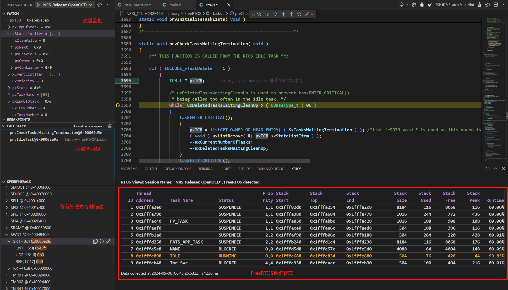

# 部署效果预览

!!! abstract
    该站点用于演示个人知识管理库通过MkDocs部署至云端的效果。通过[Mkdocs Foam Template](https://github.com/Orionxer/mkdocs_foam_template)仓库可以快速搭建个人知识管理库。

## 1.标题
### 1.1 子标题
[Foam](https://github.com/foambubble/foam) is a note-taking tool that lives within VS Code, which means you can pair it with your favorite extensions for a great editing experience.

## 2.待办列表
- [x] 已完成的项目
- [ ] 未完成的项目

## 3.双向链接
- [[DailyNote-2024-10-15]]
- [[知识库待办列表]]
- [[Sentence-2024-09]]
- [[C语言回调函数]]
- [[python回调函数]]

## 4.代码
### 4.1 行内代码
安装`mkdocs`要求`Python`版本大于等于3.8
### 4.2 代码块
单行代码
```sh
pip install -U -r requirements.txt
```
多行代码带标题
```c title="demo.c"
/********************************
 * @brief   最简单的C函数
 * @note    没有需要注意的
 ********************************/
for (size_t i = 0; i < 5; i++)
{
    printf("Hello World\n");   
}
```

## 5.图片



## 6.数学公式

Inline math: $x^2$

Math block:

$$
\displaystyle
\left( \sum_{k=1}^n a_k b_k \right)^2
\leq
\left( \sum_{k=1}^n a_k^2 \right)
\left( \sum_{k=1}^n b_k^2 \right)
$$

## 7.表格
### Git Commit常用Emoji

| Emoji |      描述      |           Demo            |
| :---: | :------------: | :------------------------------: |
|   🎉   |   创建新工程   |        🎉 Initial Commit           |
|   ✨   |     新功能     |       ✨ Added XXX       |
|   🐛   |    修复Bug     |        🐛 Fixed XXX              |
|   🔀   |    合并分支    |          🔀 Merged Branch XXX           |
|   ⚡️   |    性能提升    |        ⚡️ Improved XXX        |
|   ✅   |    通过测试    |         ✅ Passed XXX tests   |
|   ♻️   |      重构      |           ♻️ Refactored XXX        |
|   🔥   | 删除代码或文件 |        🔥 Removed XXX         |
|   📝   | 更新文档或协议 |    📝 Added/Updated License     |
|   🙈   | 忽略文件(夹) |    🙈 Ignored XXX     |
|   🔖   |    发布版本    |       🔖 Released XXX Version        |
|   💡   |    增加注释    |      💡 Commented XXX    |
