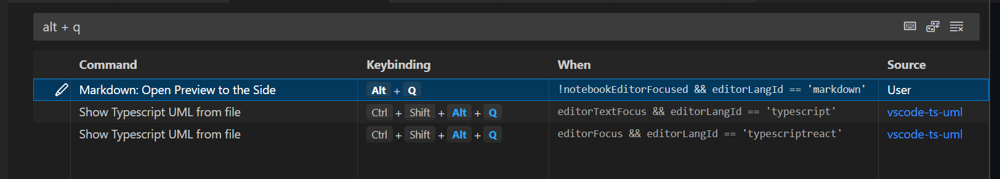
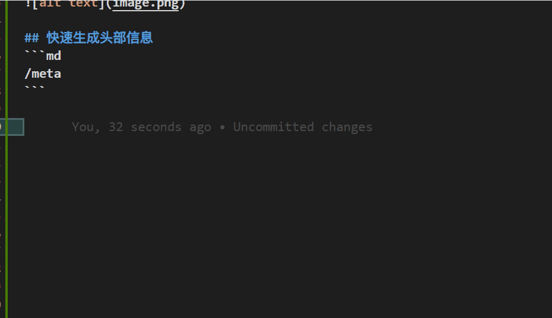
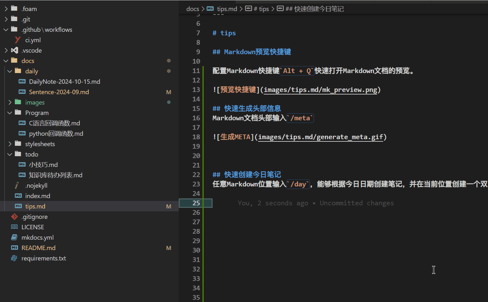
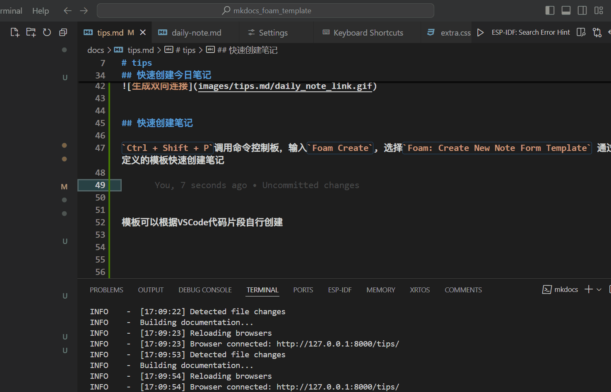

---
title: tips
date: 2024-10-18
type: Other
---

# tips

## 1.Markdown预览快捷键

配置Markdown快捷键`Alt + Q`快速打开Markdown文档的预览。

## 2.快速生成头部信息
Markdown文档头部输入`/meta`，快速生成头部信息，通过`TAB`选择分类以及标签等自定义信息，比如

## 3.快速创建今日笔记
任意Markdown位置输入`/day`，能够根据今日日期创建笔记，并在当前位置创建一个双向链接。

如果该笔记已存在，则只会创建双向链接

## 4.快速创建笔记

`Ctrl + Shift + P`调用命令控制板，输入`Foam Create`, 选择`Foam: Create New Note Form Template` 通过预定义的模板快速创建笔记

模板可以根据[VSCode代码片段](https://vscode.js.cn/docs/editor/userdefinedsnippets)自行创建

